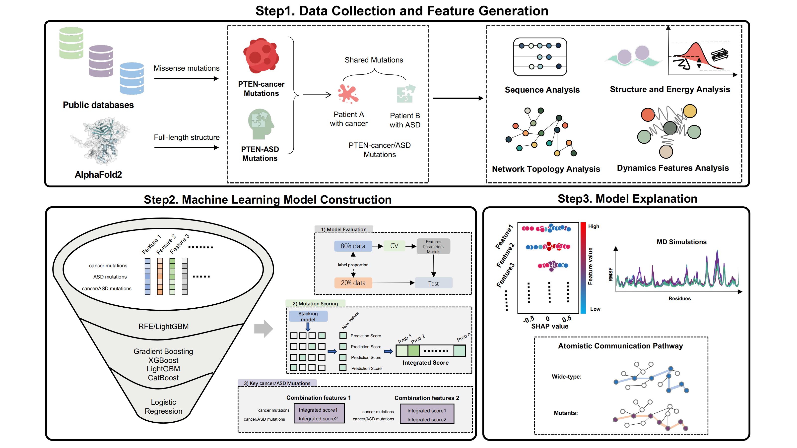
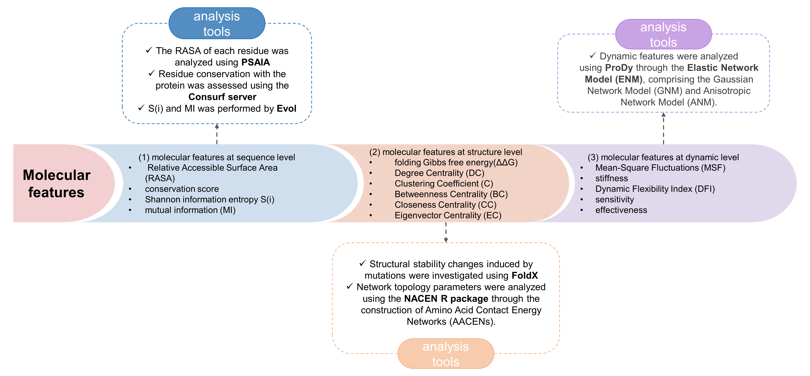

# PTEN Cancer/ASD Mutational Mechanisms

This repository contains reproducible workflows for the study:

**Machine Learning and Structural Dynamics-Based Approach to Reveal Molecular Mechanism of PTEN Missense Mutations Shared by Cancer and Autism Spectrum Disorder.**

## Overview

This project integrates machine learning and structural dynamics analyses to investigate PTEN missense mutations shared by cancer and autism spectrum disorder.

The workflow includes:

- PTEN missense mutation data collection
- Phenotype annotation
- Multiscale molecular feature calculation
- Interpretable machine learning model construction
- Integrated score-based mutation prioritization
- Molecular dynamics simulations
- RMSF analysis
- Shortest-pathway analysis
- Mechanistic interpretation of PTEN shared mutations

### Workflow overview



## Data Sources and Availability

Three types of PTEN missense mutations, including PTEN-cancer, PTEN-ASD, and PTEN-cancer/ASD mutations, along with their associated phenotypic information, were systematically retrieved from the ClinVar database ([https://www.ncbi.nlm.nih.gov/clinvar/](https://www.ncbi.nlm.nih.gov/clinvar/)), the Genome Aggregation Database ([https://gnomad.broadinstitute.org/](https://gnomad.broadinstitute.org/)), and the COSMIC database ([https://cancer.sanger.ac.uk/cosmic](https://cancer.sanger.ac.uk/cosmic)).

The codes for the machine learning model and the data for molecular dynamics simulations, including three replicates of the molecular dynamics trajectories, are available at Zenodo: [https://zenodo.org/records/15023200](https://zenodo.org/records/15023200).

### Analysis tools overview



## Repository Structure

```text
data/
docs/
notebooks/
src/
md/
results/
